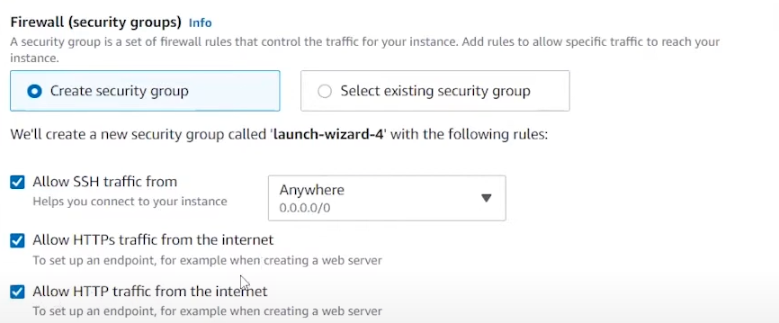
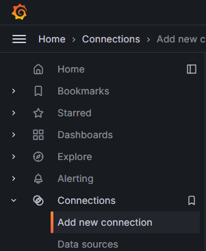
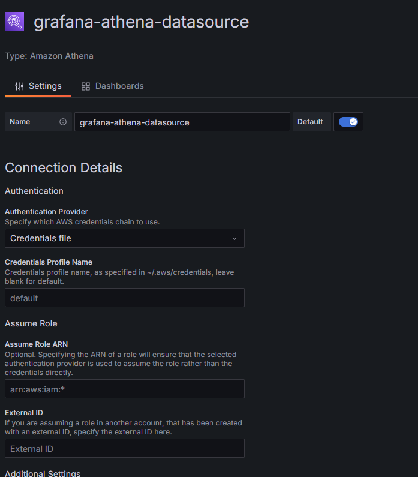
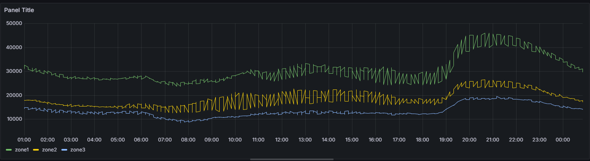

## Project Overview

The **Electric Power Consumption Forecasting System** is a fully operational machine learning pipeline designed to predict real-time electricity consumption. By leveraging historical data and integrating real-time data streams, the system provides accurate power consumption forecasts for multiple zones. The project incorporates time-series feature engineering, scalable deployment using AWS, and real-time visualization through Grafana, making it suitable for dynamic operational environments.
## Features

- **Real-Time Data Streaming**:Streams real-time data using AWS Kinesis Data Streams for continuous forecasting.
- **Electricity Usage Forecasting**:Utilizes advanced models, such as XGBoost, for accurate multi-zone power consumption predictions.
- **Time Series Feature Engineering**: Generates robust features to improve model accuracy and forecasting reliability.
- **AWS Cloud Integration**:Employs AWS services like S3 for model storage and Kinesis for real-time data ingestion and streaming.
- **Visualization with Grafana**: Provides interactive dashboards to monitor real-time power consumption trends and forecasting results.


## Prerequisites

- **Python 3.9** 
- **AWS CLI**
- **Grafana**
- **S3**

## Setup and Installation

Follow the steps below to set up and run the application:

### 1.Clone the Repository and Download the dataset

```bash
git clone https://github.com/amenallahbenothmen/aws-end-to-end-ml-pipeline.git
cd aws-end-to-end-ml-pipeline
https://www.kaggle.com/datasets/fedesoriano/electric-power-consumption

```

### 2.Create a Virtual Environment

```bash
conda create -n aws_pipeline python=3.9 -y
conda activate aws_pipeline
```


### 3.Install Dependencies

```bash
pip install -r requirements.txt

```

### 4.AWS CLI

Run these commands to create a Kinesis Data Stream

```bash
aws kinesis create-stream \
    --stream-name <stream_name> \
    --shard-count 1

```
Check if the stream has been successfully created

```bash
aws kinesis describe-stream --stream-name <stream_name>

```
### 5.Install dependencies for the lambda function 

```bash
cd lambda_testing
pip install xgboost -t .

```

### 6.Create an s3 bucket and run the notebook

### 7.Zip lambda_testing and send it to s3 bucket 

### 8.Create a lambda Function and Uplod to it the zip file 

### 9.Change the handler to lambda_testing.lambda.lambda_handler

### 10.Test the function with this exemple

```bash
{
  "Datetime": "2017-10-01 00:00:00",
  "Temperature": 18.12,
  "Humidity": 87.6,
  "WindSpeed": 4.916,
  "GeneralDiffuseFlows": 0.08,
  "DiffuseFlows": 0.163,
  "hour": 0,
  "minute": 0,
  "dayofweek": 6,
  "quarter": 4,
  "month": 10,
  "day": 10,
  "year": 2017,
  "season": 4,
  "dayofyear": 274,
  "dayofmonth": 1,
  "weekofyear": 39,
  "is_weekend": 1,
  "is_month_start": 1,
  "is_month_end": 0,
  "is_quarter_start": 1,
  "is_quarter_end": 0,
  "is_working_day": 0,
  "is_business_hours": 0,
  "is_peak_hour": 0,
  "minute_of_day": 0,
  "minute_of_week": 8640
}

```

### 10.Create a crawler and a database run the crawler

### 11.Create a Ec2 instance ubuntu 22.04

### 12.Add the Following Security Rules



### 13.Folow the commands in commands.txt to install Grafana on the Ec2 instance

```bash
commands.txt
```
### 14.Go to the ec2 instance create aws credentials file and put the aws credentials

```bash
cd ..
cd ..
cd usr/share/grafana/.aws
touch credentials

```

### 15.Add a new connection and select Amazon Athena





### 16.Create a new Dashbord with this SQL 

```bash

    CAST(
        CONCAT(
            CAST(CAST(t.year AS INT) AS VARCHAR), '-', 
            LPAD(CAST(CAST(t.month AS INT) AS VARCHAR), 2, '0'), '-', 
            LPAD(CAST(CAST(t.day AS INT) AS VARCHAR), 2, '0'), ' ', 
            LPAD(CAST(CAST(t.hour AS INT) AS VARCHAR), 2, '0'), ':', 
            LPAD(CAST(CAST(t.minute AS INT) AS VARCHAR), 2, '0')
        ) AS TIMESTAMP
    ) AS datetime,
    r.powerconsumption_zone1 AS zone1,
    r.powerconsumption_zone2 AS zone2,
    r.powerconsumption_zone3 AS zone3
FROM test t
JOIN results r 
  ON CAST(CAST(t.year AS INT) AS VARCHAR) = CAST(CAST(r.year AS INT) AS VARCHAR)
     AND CAST(CAST(t.month AS INT) AS VARCHAR) = CAST(CAST(r.month AS INT) AS VARCHAR)
     AND CAST(CAST(t.day AS INT) AS VARCHAR) = CAST(CAST(r.day AS INT) AS VARCHAR)
     AND CAST(CAST(t.hour AS INT) AS VARCHAR) = CAST(CAST(r.hour AS INT) AS VARCHAR)
     AND CAST(CAST(t.minute AS INT) AS VARCHAR) = CAST(CAST(r.minute AS INT) AS VARCHAR);

```



